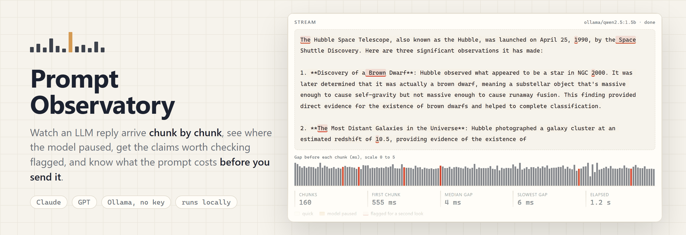
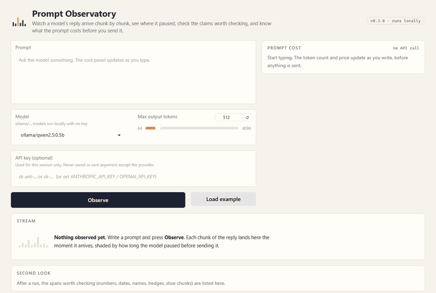
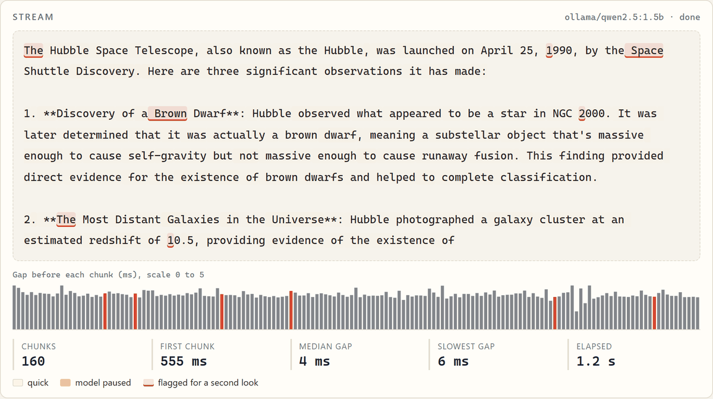
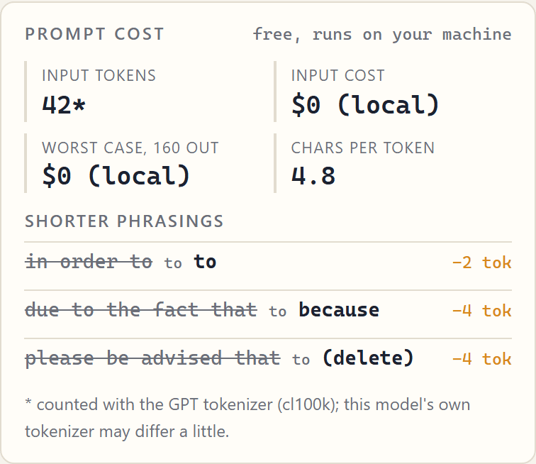
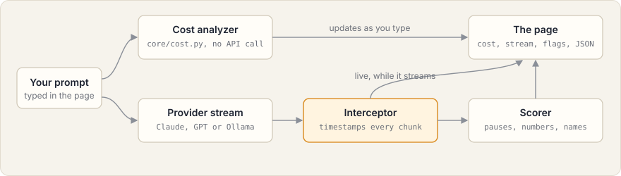

<picture>
  <source media="(prefers-color-scheme: dark)" srcset="assets/banner-dark.png">
  
</picture>

# Prompt Observatory

**A page on your own computer that shows an AI model's answer arriving piece by piece, points at the parts worth double-checking, and tells you what the question costs before you send it.**

[](https://github.com/Mattbusel/prompt-observatory/actions/workflows/ci.yml)

<picture>
  <source media="(prefers-color-scheme: dark)" srcset="assets/demo-dark.gif">
  
</picture>

<sub>Real recording, 2026-09-25: the dashboard running on Windows, answering with `qwen2.5:1.5b` through Ollama (free, no API key). Nothing in it is mocked.</sub>

## Install

| You have | Run this |
| --- | --- |
| Windows (PowerShell) | `irm https://raw.githubusercontent.com/Mattbusel/prompt-observatory/master/install.ps1 \| iex` |
| Windows with [Scoop](https://scoop.sh) | `scoop bucket add mattbusel https://github.com/Mattbusel/scoop-bucket; scoop install mattbusel/prompt-observatory` |
| macOS or Linux | `curl -fsSL https://raw.githubusercontent.com/Mattbusel/prompt-observatory/master/install.sh \| sh` |
| macOS or Linux with Homebrew | `brew install mattbusel/tap/prompt-observatory` |
| Python 3.10+ and pipx | `pipx install git+https://github.com/Mattbusel/prompt-observatory` |
| Nothing, just a download | [Releases](https://github.com/Mattbusel/prompt-observatory/releases/latest): Windows `.zip`, macOS `arm64` / `x86_64` and Linux `x86_64` `.tar.gz`; unzip and run `prompt-observatory` |

The scripts download the release for your system, check its SHA-256 against the release's `SHA256SUMS.txt`, and put one file in `~/.local/bin` (macOS/Linux) or `%LOCALAPPDATA%\Programs\prompt-observatory` (Windows, added to your PATH).

The prebuilt apps are one file of about 95 MB (Python and the web UI are inside). They are unsigned: on Windows click **More info**, then **Run anyway**; on macOS right-click it and choose **Open** the first time. It is not on PyPI.

## Use it in 3 steps

**1. Pick what answers.** Either an API key, or a free model that runs on your machine:

```bash
export ANTHROPIC_API_KEY=sk-ant-...     # or OPENAI_API_KEY=sk-...  (or paste it in the page later)
# no key? install Ollama from https://ollama.com, then:
ollama pull qwen2.5:1.5b
```

**2. Start it.**

```bash
prompt-observatory
```

```text
Prompt Observatory 0.3.0
Ready: Ollama: 2 local models.
Starting the dashboard at http://127.0.0.1:7860
Leave this window open while you use it. Press Ctrl+C to stop.
```

Open http://127.0.0.1:7860 (the prebuilt app opens it for you).

**3. Type a prompt and press Observe.** The **Prompt cost** panel fills in while you type. The reply then streams into the **Stream** panel, and when it finishes the **Second look** panel lists what to verify. Press **Load example** if you just want to see it work.

## Results

One real run from today, local model `qwen2.5:1.5b` on this Windows PC, using the built-in example prompt:

| What the page measured | Value |
| --- | --- |
| Prompt tokens (cl100k count) | 42 |
| Wordy phrases it found | 3 (`in order to`, `due to the fact that`, `please be advised that`), about 10 tokens |
| Time to the first chunk | 555 ms |
| Chunks, median gap between them | 160 chunks, 4 ms |
| Whole reply | 1.2 s |
| Flagged for a second look | 7 (3 numbers or dates, 4 named entities) |

The model wrote that Hubble launched on **April 25, 1990**. It actually launched on April 24, 1990. The page did not know that, but it did put `1990` on the list of things to check, which is the point: it tells you where to look, not what is true.

<table>
<tr>
<td width="62%"></td>
<td></td>
</tr>
</table>

## What each panel does

- **Prompt cost.** Counts tokens with `tiktoken` as you type (no API call), prices input and worst-case output from a built-in table, and suggests shorter phrasings (`in order to` to `to`, `due to the fact that` to `because`, ...). Local Ollama models cost $0.
- **Stream.** Shows each chunk the moment it arrives. A chunk is shaded when the model paused before it (at least 120 ms and 4 times the run's median gap). Below the text: a strip chart of the gap before every chunk, time to first chunk, median and slowest gap, and total time.
- **Second look.** A heuristic scorer flags numbers and dates, multi-word names, hedges (`probably`, `approximately`, `I think`, ...) and real pauses, and gives a low / medium / high level. A flag means "check this", not "this is wrong".
- **Session JSON.** Everything above in one JSON document you can copy.

Models: `claude-opus-5`, `claude-sonnet-5`, `claude-sonnet-4-6`, `claude-opus-4-6`, `claude-haiku-4-5`, `gpt-4o`, `gpt-4o-mini`, plus every model installed in a running Ollama (shown as `ollama/<name>`). You can also type any other model name.

<details>
<summary><b>Command line options</b></summary>

```text
prompt-observatory [--port 7860] [--host 127.0.0.1] [--share] [--api-key KEY] [--open | --no-open] [--version]
```

- `--port`, `--host`: where to serve (default `127.0.0.1:7860`).
- `--share`: also create a public Gradio link.
- `--api-key KEY`: sets `ANTHROPIC_API_KEY` if it is not set.
- `--open` / `--no-open`: open a browser tab (the prebuilt app opens one by default).
- `OLLAMA_HOST`: where Ollama is running, if not `http://localhost:11434`.

Installed with pipx, the command is also available as `observatory`.

</details>

<details>
<summary><b>How it works</b></summary>



```
observatory/
  app.py                 the page, the CLI, and the streaming pipeline
  core/
    stream.py            TokenStreamInterceptor: timestamps each chunk as it arrives
    hallucination.py     HallucinationScorer: pause, hedge, number and name heuristics
    cost.py              PromptCostAnalyzer: tiktoken counts, prices, shorter phrasings
  providers/
    anthropic.py         Claude via anthropic.AsyncAnthropic
    openai.py            GPT via openai.AsyncOpenAI
    ollama.py            local models via Ollama's OpenAI-compatible endpoint
  ui/export.py           JSON and HTML session reports
tests/                   44 tests, no API key or network needed
```

The provider stream is read in its own task, so each chunk is timestamped when it arrives rather than when the page finishes drawing the previous one.

</details>

<details>
<summary><b>From source, and tests</b></summary>

Python 3.10+.

```bash
git clone https://github.com/Mattbusel/prompt-observatory
cd prompt-observatory
pip install -e ".[dev]"
python -m observatory
pytest
```

</details>

## Limitations

- It is a heuristic, not a fact checker. Any four-digit number and any run of capitalized words gets flagged; a wrong claim in plain lowercase words does not.
- Timing includes your network and the provider's batching. A local model gives the cleanest signal.
- Claude and Ollama token counts use the GPT tokenizer, so they are close but not exact.
- Prices in `core/cost.py` were checked on 2026-09-25 and are hardcoded.
- One prompt per run; no side-by-side comparison.

## Related

Started from ideas in three repos by the same author: [Every-Other-Token](https://github.com/Mattbusel/Every-Other-Token) (stream interception), [LLM-Hallucination-Detection-Script](https://github.com/Mattbusel/LLM-Hallucination-Detection-Script) (confidence flags) and [Token-Visualizer](https://github.com/Mattbusel/Token-Visualizer) (prompt token analysis).

MIT license.
